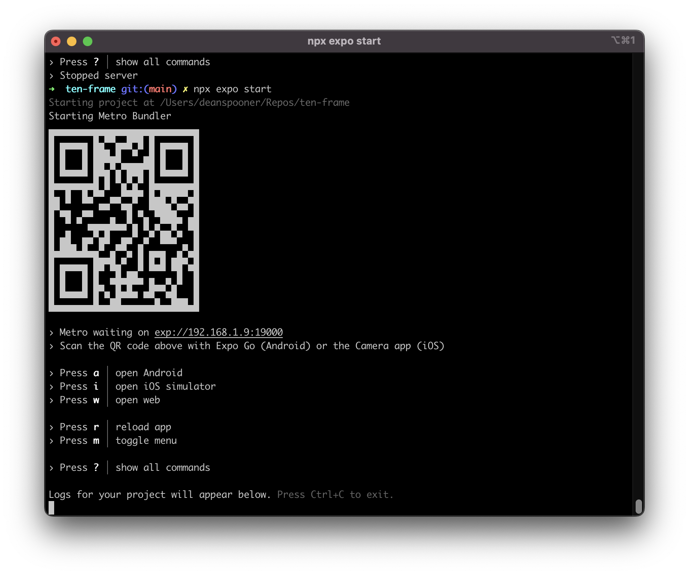
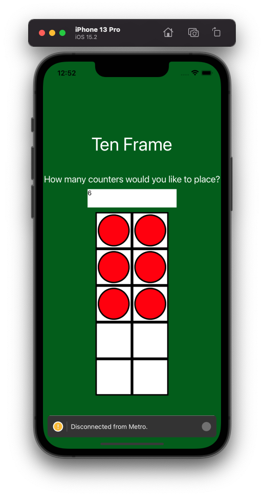
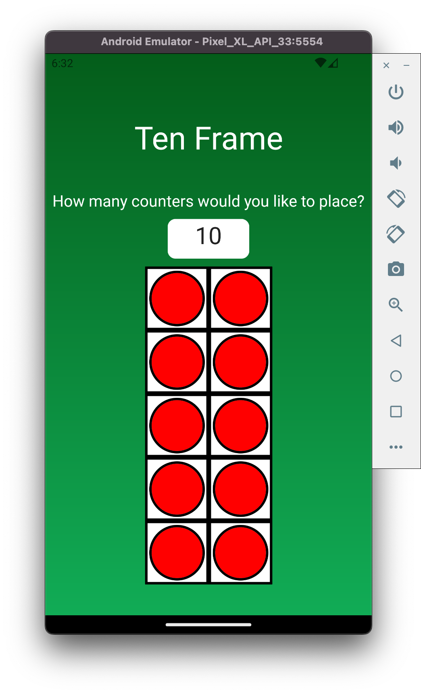

# Ten-Frame by [Dean Spooner](https://github.com/DeanSpooner) ➕➖✖️➗

Welcome to the Ten-Frame repository by Dean Spooner. The aim of this project is to provide a simple, interactible mathematical ten-frame that children can use as on an app, capable of running on both Android and iOS devices.

## Project aims:

- [x] Interactible ten-frame with input, working on iOS and Android;
- [x] Ensure number input can only be between 0 and 10;
- [x] Ensure only digits and no alphabetical or special characters can be input;
- [ ] Testing suites implemented;
- [ ] Hamburger menu;
- [ ] Game to match number of counters with an amount in a certain time;
- [ ] Saving a high-score;
- [ ] Scaled-up for tablets.

## Running locally:

Please note: the following steps will require [Xcode](https://developer.apple.com/xcode/) and [Android Studio](https://developer.android.com/studio) installed, to run on iOS and Android simulators respectively.

In your terminal, cd into `ten-frame`:

- `npm install`
- `npx expo start`
- Select the Simulator to run this in, or scan the QR code to run this app on your device (requires Expo Go app);
  </img>
    
  </img>
    
  </img>

- NOTE: You may need your Android simulator running prior to selecting it in the CLI; it may need to be configured to have more storage space within its settings on Android Studio.

## Built with:

- React Native;

- Expo;

- JavaScript;

- Android Studio;

- Xcode iOS Simulator;

- NPM / NPX;

- Homebrew.

## Version history

| Version | Date       | Description                                                                                                                                                                         |
| ------- | ---------- | ----------------------------------------------------------------------------------------------------------------------------------------------------------------------------------- |
| 0.0.1   | 30.09.2022 | Initial project set up with boilerplate code, using React Native and Expo.                                                                                                          |
| 0.1.0   | 01.10.2022 | Basic interactive ten-frame with input created; styles and components tidied up and organised.                                                                                      |
| 0.2.0   | 01.10.2022 | Changes to styles to prevent errors on Android; helper function implemented to only allow a number from 0 to 10 to be input, preventing special characters, preventing pasting etc. |
| 0.2.1   | 01.10.2022 | README.md updated with project aims checklist and instructions for running locally on simulators and devices.                                                                       |
| 0.2.2   | 01.10.2022 | README.md updated with new iPhone image.                                                                                                                                            |
| 0.2.3   | 01.10.2022 | Helper function to prevented unwanted character in as second digit.                                                                                                                 |

# By [Dean Spooner](https://github.com/DeanSpooner), 2022
