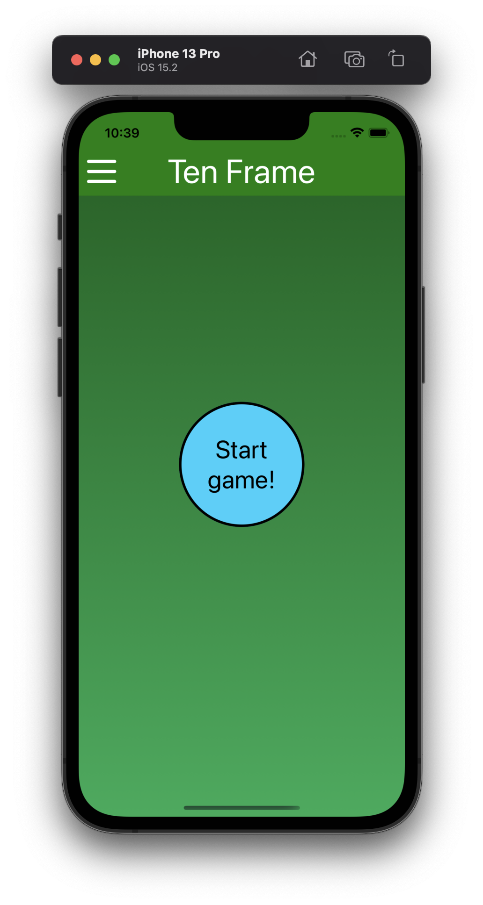

# Ten Frame by [Dean Spooner](https://github.com/DeanSpooner)

</img>

Welcome to the Ten Frame repository by Dean Spooner. The aim of this project is to provide a simple, interactible mathematical ten-frame that children can use on an app. This app is capable of running on both Android and iOS devices.

## Project aims and future goals:

- [x] Interactible ten-frame with input, working on iOS and Android;
- [x] Ensure number input can only be between 0 and 10;
- [x] Ensure only digits and no alphabetical or special characters can be input;
- [x] Jest testing suites implemented;
- [x] Hamburger menu;
- [x] Different screens selectable from Hamburger menu;
- [x] Touchable ten-frame that will show the amount of counters put down;
- [x] Game to match number of counters with an amount in a certain time;
- [ ] Saving a high-score;
- [ ] Scaled-up for tablets.

## Built with:

- React Native;
- Expo;
- TypeScript/JavaScript;
- Android Studio;
- Xcode iOS Simulator;
- Node (v16.15.1);
- NPM / NPX;
- Homebrew;
- Jest.

## Running locally:

Please note: the following steps will require [Xcode](https://developer.apple.com/xcode/) and [Android Studio](https://developer.android.com/studio) installed, to run on iOS and Android simulators respectively. You will also need [Node](https://nodejs.dev/en/) installed to run npm/npx commands.

In your terminal, cd into `ten-frame`:

- `npm install`
- `npx expo start`
- Select the Simulator to run this in, or scan the QR code to run this app on your device (requires Expo Go app);
- NOTE: You may need your Android simulator running prior to selecting it in the CLI; it may need to be configured to have more storage space within its settings on Android Studio.

  </img>

## Running tests:

In your terminal, cd into `ten-frame` then run:

- `npm install` (if not ran before)
- `npm run test`

Jest will now run the tests and check against snapshots that have been added to this project.

## Running TypeScript checks:

In your terminal, cd into `ten-frame` then run:

- `npm install typescript -g`(if you don't have already TypeScript installed on your machine)
- `tsc`

## Modes:

### Home:

</img>

### Menu:

</img>

### Ten Frame - Input:

Here, you can type in a number from 0 to 10, to see the matching number of counters show on a ten frame:

</img>

</img>

### Ten Frame - Touch:

In this mode, you can touch the squares on the grid to add or remove a counter there, and see the total number of counters you have put down:

</img>

</img>

### Ten Frame - Game:

Here, you can play a game where you try to count as many correct sets of counters on a ten-frame as possible, in sixty seconds. Your score and total answers are tracked throughout, and at the end you can reset the game to try again:

Start screen:

</img>

</img>

In game:

</img>

</img>

End screen:

</img>

</img>

### About:

</img>

## Version history:

| Version | Date       | Description                                                                                                                                                                         |
| ------- | ---------- | ----------------------------------------------------------------------------------------------------------------------------------------------------------------------------------- |
| 0.0.1   | 30.09.2022 | Initial project set up with boilerplate code, using React Native and Expo.                                                                                                          |
| 0.1.0   | 01.10.2022 | Basic interactive ten-frame with input created; styles and components tidied up and organised.                                                                                      |
| 0.2.0   | 01.10.2022 | Changes to styles to prevent errors on Android; helper function implemented to only allow a number from 0 to 10 to be input, preventing special characters, preventing pasting etc. |
| 0.2.1   | 01.10.2022 | README.md updated with project aims checklist and instructions for running locally on simulators and devices.                                                                       |
| 0.2.2   | 01.10.2022 | README.md updated with new iPhone image.                                                                                                                                            |
| 0.2.3   | 01.10.2022 | Helper function to prevented unwanted character in as second digit.                                                                                                                 |
| 0.3.0   | 01.10.2022 | Jest testing implemented and configured correctly. Base tests and snapshots added for App.js and Table.jsx.                                                                         |
| 0.3.1   | 01.10.2022 | README.md updated with testing steps.                                                                                                                                               |
| 0.3.2   | 01.10.2022 | README.md tweaked to include Node note.                                                                                                                                             |
| 0.3.3   | 01.10.2022 | Ten Frame icon added to assets and README.md.                                                                                                                                       |
| 0.3.4   | 01.10.2022 | Renamed array in Table.jsx.                                                                                                                                                         |
| 0.4.0   | 01.10.2022 | Styling updated for background and input. Screenshots updated.                                                                                                                      |
| 0.4.1   | 01.10.2022 | Ten-frame rotated to horizontal position. Counters now are a random colour each time the input number is changed.                                                                   |
| 0.4.2   | 01.10.2022 | Ten Frame icon updated.                                                                                                                                                             |
| 0.4.3   | 01.10.2022 | Text enlarged. Screenshots updated.                                                                                                                                                 |
| 0.4.4   | 01.10.2022 | Slight padding added to viewport. Screenshots updated.                                                                                                                              |
| 0.5.0   | 02.10.2022 | Re-organisation of project, splitting of main screen into separate component out of App.js. Tests added/updated.                                                                    |
| 0.6.0   | 02.10.2022 | Header added with tests.                                                                                                                                                            |
| 0.6.1   | 02.10.2022 | Hamburger icon created and implemented into header.                                                                                                                                 |
| 0.6.2   | 02.10.2022 | Close icon added. Touch functionality now implemented to open and close a top-down drawer from the header.                                                                          |
| 0.6.3   | 02.10.2022 | Home screen added. Menu items added to hamburger menu, implemented correctly.                                                                                                       |
| 0.6.4   | 02.10.2022 | About screen added. More screenshots added to README.md.                                                                                                                            |
| 0.7.0   | 02.10.2022 | Added touchable ten-frame. More screenshots added to README.md.                                                                                                                     |
| 0.8.0   | 02.10.2022 | TypeScript implemented and fixed across all React components.                                                                                                                       |
| 0.8.1   | 02.10.2022 | Further type declarations and fixes.                                                                                                                                                |
| 0.8.2   | 02.10.2022 | All tests updated to .tsx format.                                                                                                                                                   |
| 0.8.3   | 02.10.2022 | All style files updated to .ts format.                                                                                                                                              |
| 0.8.4   | 02.10.2022 | Ten Frame logo updated. README.md updated.                                                                                                                                          |
| 0.9.0   | 02.10.2022 | Game mode added, tracking score and total answers. Tests added.                                                                                                                     |
| 1.0.0   | 02.10.2022 | Game mode completed, with 60 second timer once game starts, and reset button at end. More screenshots added to README.md.                                                           |
| 1.0.1   | 03.10.2022 | Moved files into src folder.                                                                                                                                                        |
| 1.0.2   | 03.10.2022 | Optional chaining added to test files to prevent potential null errors.                                                                                                             |
| 1.0.3   | 03.10.2022 | More TypeScript fixes for tests.                                                                                                                                                    |
| 1.0.4   | 03.10.2022 | Updated snapshots.                                                                                                                                                                  |
| 1.1.0   | 03.10.2022 | Helper functions implemented to reduce repetition.                                                                                                                                  |
| 1.1.1   | 03.10.2022 | Data folder added with screens variable. Screens menu buttons added to home screen.                                                                                                 |

</img>

# By [Dean Spooner](https://github.com/DeanSpooner), 2022

